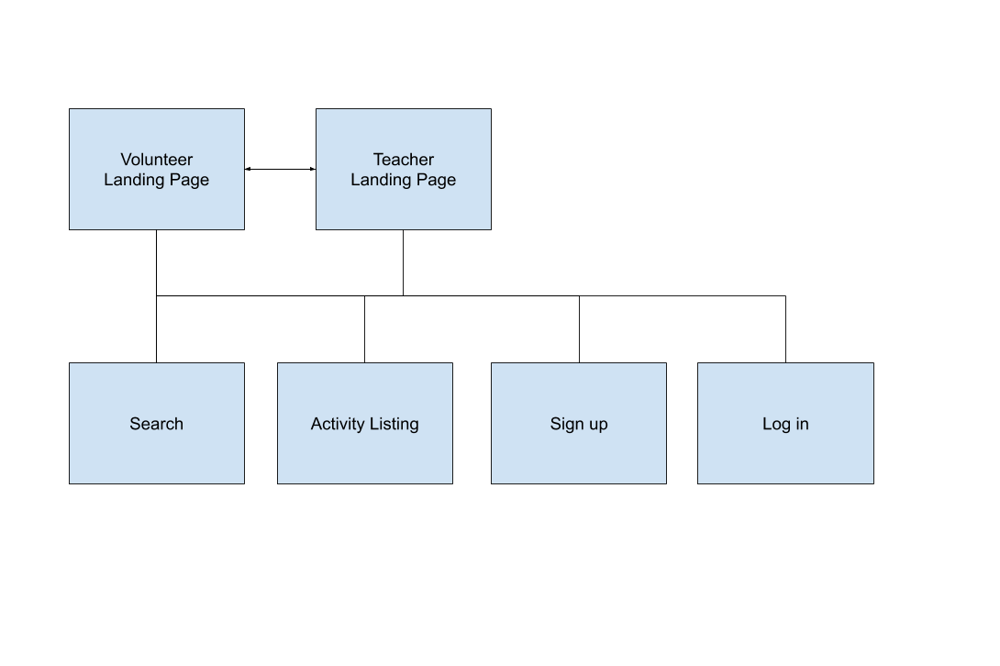
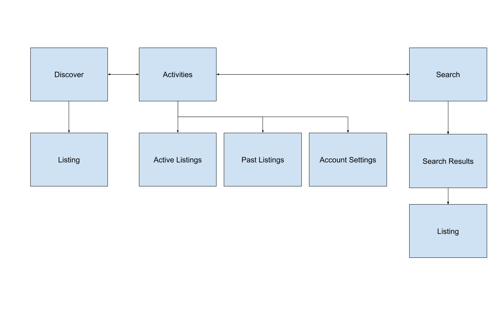
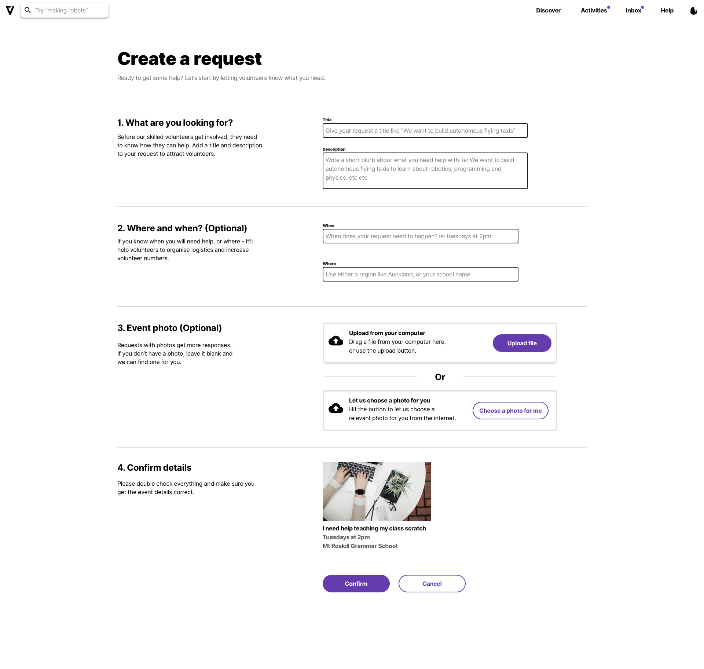

# Voluntari.ly

Quick design overview

Note: Speaker Notes here

---

# Design tools

* Sketch (drawing tool)
* Abstract (design file control)
* Invision (prototyping)

---

# MVP overview

* Two user types:
  * Volunteers
  * Teachers

* What we have so far
  * Landing Page
  * Signup
  * Teachers can CRUD request for things
  
---

# MVP Volunteer - Not Logged In

  
---

# MVP Volunteer - Logged In

---

# A quick look at the latest prototype
 

---

# Where are the prototypes? 

https://invis.io/P3RU0M4896T - Latest prototypes
https://invis.io/T8RD37TGH45 - Style Guide

Links to this can also be found on the confluence page
