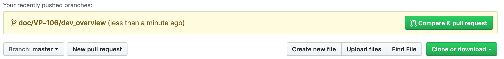
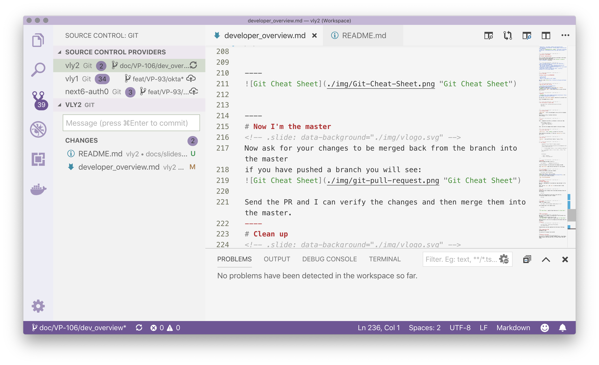
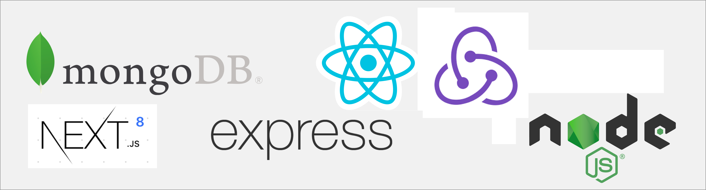
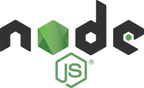
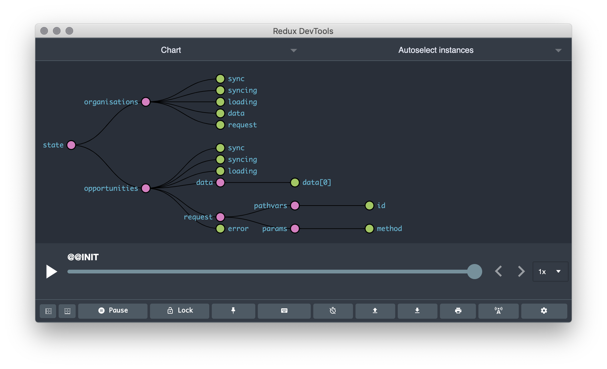
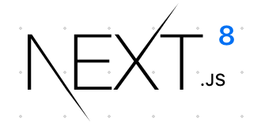
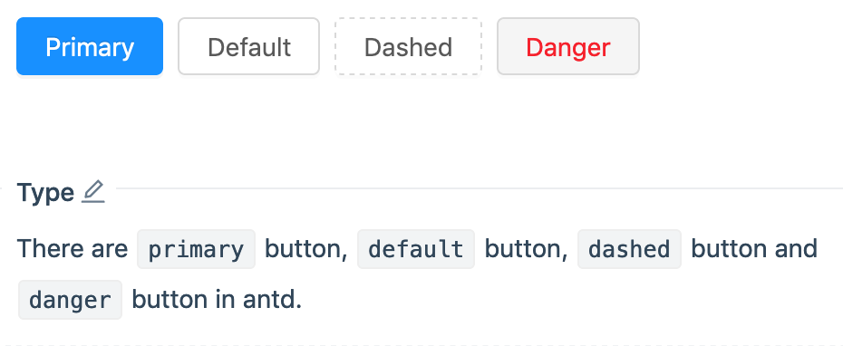

---
# Voluntari.ly
Developer Overview

---
# Join the Voluntari.ly community

Support education and innovation in New Zealand Schools with industry experts and volunteers in the classrooms

Note: Speaker Notes here

---

# Purpose
We are building a platform that connects corporate volunteer time with classrooms to teach science & technology, engineering, entrepreneurship, arts and design

with the help of engaging content supplied by New Zealand’s leading innovators in educational content.

---

# How to Help

* Sponsorship - give money, guidance and networking help
* Volunteering on the platform - find and commit to activites put up by requestors.
* Contribute to building the platform - help develop a world class open source project.

---

# How to Help

* Sponsorship - give money, guidance and networking help
* Volunteering on the platform - find and commit to activites put up by requestors.
* Contribute to building the platform - help develop a world class open source project. 

---

# Contribute to Development

### You don't need permission!

This is an open source project and you are welcome to contribute at any level you feel comfortable.
Find out more about the project at the [Voluntari.ly website](http://voluntarily.nz) and then...

---
## Places
* Info: http://voluntarily.nz blog and events
* Chat: https://gitter.im/voluntarily/community
* Docs: https://voluntarily.atlassian.net
* Code: https://github.com/voluntarily

---

# First Challenge

## Add your name to the CONTRIBUTORS

* clone the code
* edit the file
* check it in and send us a pull request

Use this ticket [VP-82](https://voluntarily.atlassian.net/browse/VP-82)

----

# What you need to get started

* [Git](https://git-scm.com/book/en/v2/Getting-Started-Installing-Git)
You probably already have it. Verify with `git --version`
* [Nodejs](https://nodejs.org/en/download/).
Verify this with `node -v` which should return a current version. e.g. v12.1.0

----

# Mongo DB

* [MongoDB](https://docs.mongodb.com/manual/installation/) https://docs.mongodb.com/manual/installation/

For mac users `brew install mongodb` should be all you need to do.

Start the mongodb service `mongod`

For Windows users [Click here](https://docs.mongodb.com/manual/tutorial/install-mongodb-on-windows/) for instructions on installing MongoDB and MongoDB Compass.

----

# Get the Voluntari.ly source code

    git clone https://github.com/voluntarily/vly2.git
    cd vly2
    npm install

----

# you served my father

`npm run dev` - starts the development server with hot reloading enabled

Open browser at http://localhost:3122/test
ctrl+c to exit

----

# Jedi(t)

Edit ./components/test/Hello.js and make it salute your name.

    export default (props) =>
      

        Hello, *Your name here*!
      

Save - and the test webpage should update to show your change.

----

# You're all clear, kid

`npm run lint` - runs _standard_ to check for lint errors

There should be no warnings. If there are `npm run fix` to fix most errors.

----

# Run the Tests

`npm test` - runs any AVA tests found in *.spec.js files.

----

# 1 test failed

      components › test › Hello › renders properly

      /Users/watkinsav/workspace/voluntarily/vly2/components/test/__tests__/Hello.spec.js:8

      7:   t.truthy(wrapper.find('p').first().hasClass('greeting'))
      8:   t.is(wrapper.find('p').first().text(), 'Hello, *Your name here*!')
      9: })

      Difference:

      - 'Hello, *Andrew*!'
      + 'Hello, *Your name here*!'

----

# Undo Undo
Undo the change you made to hello.js

    git checkout --  ./components/test/Hello.js

To get the original file and discard the changes you made.

Then `npm run test` again and you should get all tests passed.

----

# Ch ch ch changes
Create a git branch to hold your changes:

    git branch 'doc/VP-82/andrew'

Change to your git branch:

    git checkout doc/VP-82/andrew

format branch name as: type/jira/label.
[VP-82](https://voluntarily.atlassian.net/browse/VP-82) is the jira ticket used to add contributors.

`type = doc|feat|bug|merge`

----

# Do the work
#### magic happens here

Edit the ./CONTRIBUTORS file and add your name and email to the bottom.

Save - and run `lint`  and `test` to check you didn't break anything.

----

# Pull up!
Fetches the latest changes others have made and merges them into your branch.

    git pull

After this you may have to test and fix any conflicts.
Then add the changes you want to commit

    git add .

----

# Push back!
Commit the changes locally

    git commit -m"VP-82 #comment Added andrew to list"

Push changes back to the remote origin

    git push

----

----

# Now I'm the master

Now ask for your changes to be merged back from the branch into the master
if you have pushed a branch you will see:

Send the PR and I can verify the changes and then merge them into the master.
----
# Clean up

    git push origin --delete doc/VP-82/andrew
    git checkout master

Congratulations you have completed the Contributor Challenge.

----
# Use a good editor/IDE
Recommend VS Code https://code.visualstudio.com/

You can do all the above from the GUI.

---

# MERN, MERRANIN RAMINNER?

Voluntari.ly uses MongoDB, Node, Express, React, Redux, Next, Intl and AntD

Yes it is Javascript all the way down.
---

https://nodejs.org/

----
# Node

Node.js® is a JavaScript runtime built on Chrome's V8 JavaScript engine.

Which means you can run Javascript outside of a browser.

Which means you can write command line and server side programmes.
----
## Which means you can write this

    // Call the console.log function.
    console.log('Hello World')

and run it

    node helloworld.js
    Hello World

----
## And this...

    // Load the http module to create an http server.
    const http = require('http')

    // Configure our HTTP server to respond with Hello World to all requests.
    const server = http.createServer((request, response) => {
      response.writeHead(200, { 'Content-Type': 'text/plain' })
      response.end('Hello World\n')
    })

    server.listen(8001) // defaults to 127.0.0.1

    // Put a friendly message on the terminal
    console.log('Server running at http://127.0.0.1:8001/')

---

https://expressjs.org/

----
# Express
We use express to handle the server side activities that will return a page for each request made and handle the API calls.

    const express = require('express')
    const app = express()
    const port = 3000

    app.get('/', (req, res) => res.send('Hello World!'))
    app.get('/rick', (req, res) => res.send('Never going to give you up, Never going to let you down.'))
    app.listen(port, () => console.log(`Example app listening on port ${port}!`))

---

https://www.mongodb.com/

----
# Mongo DB
MongoDB is a document-oriented database program. Free and open source

Instead of SQL with relational rows and tables MongoDB stores JSON-like documents and provides ways to retrieve those documents based on the internal fields.

    {
      "title": "Self driving model cars ",
      "subtitle": "using algorithmns to follow lines and avoid obstacles",
      "imgUrl": "http://www.plaz-tech.com/wp-content/plugins/wp-easycart-data/products/pics1/Arduino%20Car%202_8ab5dd38f1e3f6f05ad244f1e5e74529.jpg",
      "description": "# NZTA Innovation Centre\n \n We have 6 model cars with sensors for vision..."
      "duration": "4 hours",
      "location": "NZTA Innovation Centre, 5 Cook St Auckland",
      "status": "draft"
    }

----
# Mongo in Dev & Test
For Dev we use a local database

    mongod

or you can use a docker container

    docker run --name db -d -v /data/db -p:27017:27017 mongo:latest

and set the connect string in the environment

    MONGODB_URI: mongodb://db:27017/vly-dev

----
# Mongo in UAT & Prod
For Production and UAT we use a cloud hosted database:

MongoDB Atlas. https://docs.atlas.mongodb.com/

and need this connect string:

    MONGODB_URI: mongodb+srv://vly-client:<PASSWORD@voluntarily-mongo-cluster-test-r6dzi.mongodb.net/vly-alpha?retryWrites=true&w=majority
----

# Mongoose
The node Mongoose library gives us an easy way to make calls to the database.

We can define the document schema

    const mongoose = require('mongoose')
    const Schema = mongoose.Schema

    const organisationSchema = new Schema({
    name: { type: 'String', required: true },
    slug: { type: 'String', required: true },
    about: { type: 'String', required: true },

----
# Mongoose

Create a document of that type:

    const oppo = new Opportunity({
        title: 'The first 200 metres',
        subtitle: 'Launching into space step 2',
        imgUrl: 'https://image.flaticon.com/icons/svg/206/206857.svg',
        description: 'Project to build a simple rocket that will reach 200m',
    });

----

And save it to the database

    oppo.save();

---

A JavaScript library for building user interfaces
https://reactjs.org/

----
# Declarative

Create components that look and work like HTML but can handle code and data.

    const Hello = ({ name }) => 
Hello, {name}

    export default Hello

Usage:

    <h1><Hello name='Andrew' /></h1>

----
# Components

Application is built from...

dumb components that just render data:

    <OpCard size-'Small' op={op} />

----
# Components
and smarter components or pages that obtain data and handle interactions

    class Ops extends Component {
      static async getInitialProps ({ store, query }) {
        // Get all Opportunities
        const ops = await store.dispatch(reduxApi.actions.opportunities.get())
        return { ops, query }
      }

      render () {
        return (<OpList ops={this.props.ops} />)
      }
    }

---

A predictable state container for JavaScript apps.

https://redux.js.org/

----
# Predictable

Redux helps us write applications that behave consistently, run in different environments (client, server, and native), and are easy to test.
----
# Centralized

Centralizing the application's state and logic enables powerful capabilities like undo/redo, state persistence, and much more.

There is one place where all the information is held and we can access it from any component.

----
# Debuggable

The Redux DevTools make it easy to trace when, where, why, and how our application's state changed. Redux's architecture lets you log changes, use "time-travel debugging", and even send complete error reports to a server.

---

https://nextjs.org/

----
# Next

The Next JS Framework helps us put it all together.

It is a React Framework that provides us with

* Server Side Rendering SSR
* Static exports
* CSS in JS
* minimal config
* Production friendly builds
* Use all the latest Javascript code styles

---
# Ant Design (React)

https://ant.design/

----
# A set of design values

https://ant.design/docs/spec/values

----
# A set of components
Ant Design of React https://ant.design/components/

----
# A set of components

    import { Button } from 'antd';

    const Buttons = () => {
        

            <Button type="primary">Primary</Button>
            <Button>Default</Button>
            <Button type="dashed">Dashed</Button>
            <Button type="danger">Danger</Button>
        

    }
---
# Internationalisation

## Voluntari.ly is multilingual

[Background](https://voluntarily.atlassian.net/wiki/spaces/VP/pages/4423681/Voluntari.ly+is+Multilingual)

---

# Use react-intl library

https://github.com/yahoo/react-intl

This library provides React components and an API to format dates, numbers, and strings, including pluralization and handling translations.

He tika i te timatanga  | it is right from the start

---
# Example - IntlDemo.js

    import { FormattedMessage, FormattedNumber } from 'react-intl'
    export const Test = () =>
    

        <h1>Test Internationalisation Formatting</h1>
        <FormattedMessage
            id='demo.greeting'
            defaultMessage='Hello World!'
            description='Use the local equivalent of Hello World.'
        />
    &nbsp;
        <FormattedNumber value={1000} />
    

---
## Rules for Intl

* All strings that appear on the screen should be translatable. - use the FormattedMessage wrapper.

* Numbers, plurals, dates and times should also use their respective wrappers.

* The messages are collected automatically and the en.json file is generated. This will be profesionally translated ( Do not rely on Google)

* See the About page for how to manage whole pages of translatable content.
* 
---
## Identity and Access Management

https://auth0.com/

---

## Cloud service for identity

Get somone else to do the work for:

* registration,
* email validation,
* sign in/out,
* password reset,
* social logins (Google, LinkedIn)
* OAuth, SAML, AD etc.

---
## Voluntarily.nz
 

---
## Voluntarily.nz
 

---

# &nbsp;
 

---
